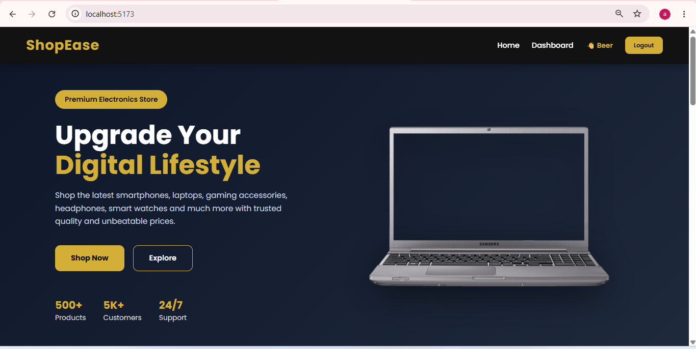
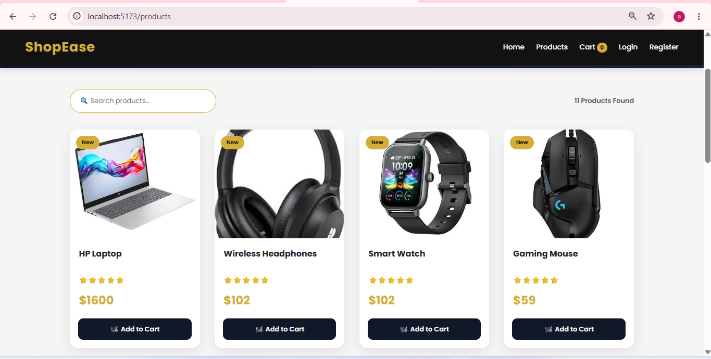
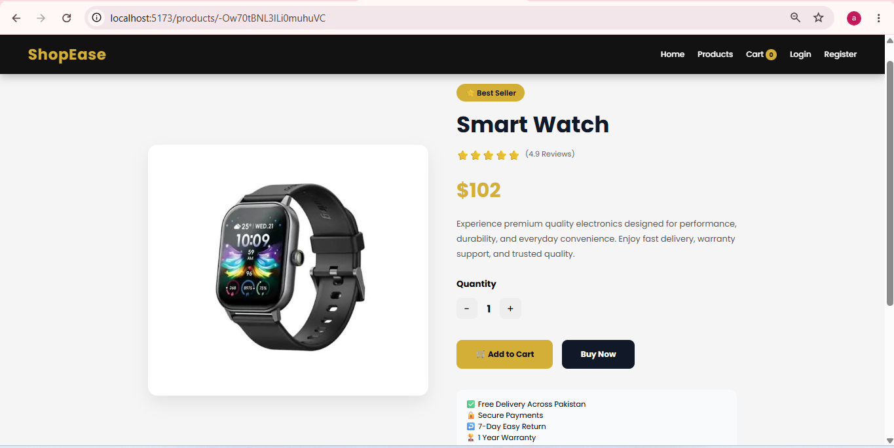
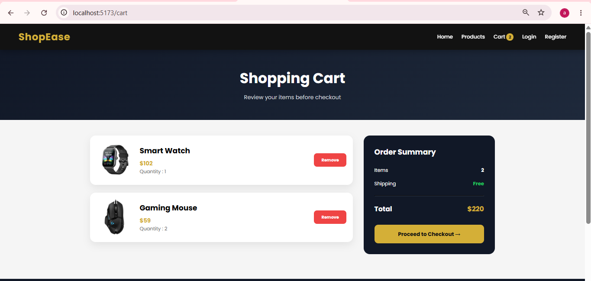
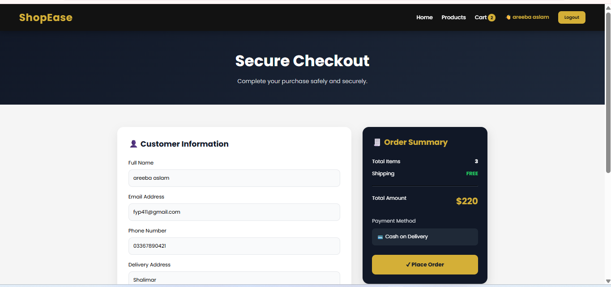
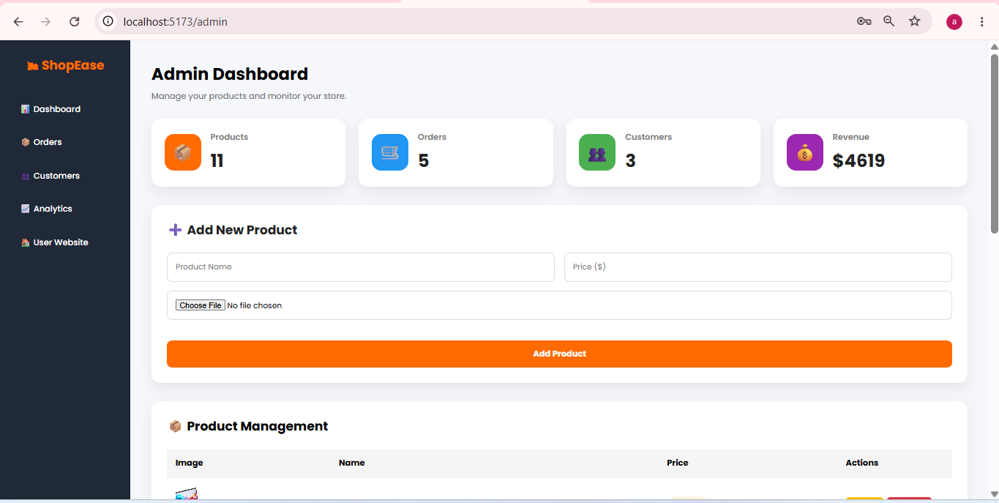
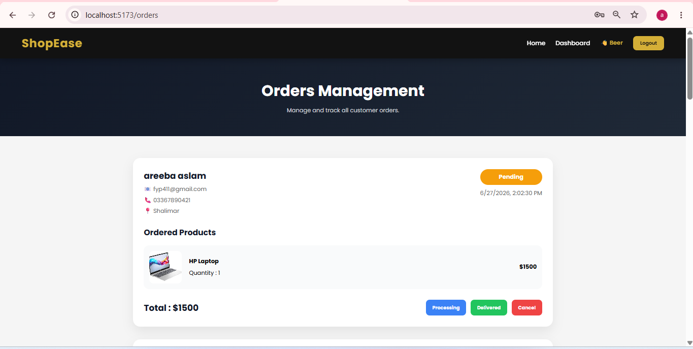
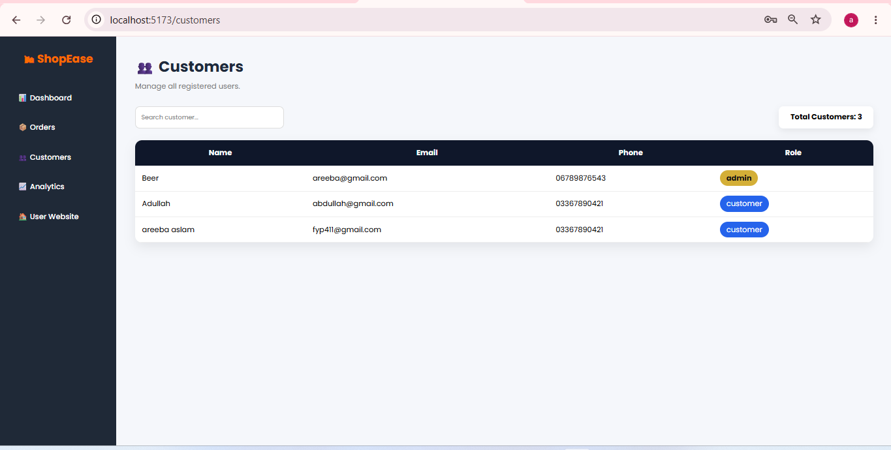
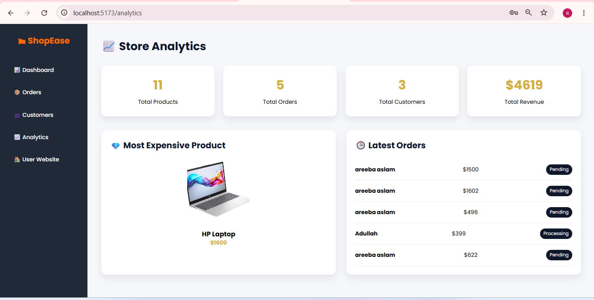

# ShopEase - Full Stack eCommerce Web Application

## Project Overview
ShopEase is a modern full-stack eCommerce web application developed using React.js and Firebase. It allows customers to browse products, view product details, manage their shopping cart, place orders, and provides an admin dashboard for managing products, customers, orders, and analytics.
The application is fully responsive and designed for both desktop and mobile devices.

## Features
### Customer Features
* User Registration & Login
* Firebase Authentication
* Browse Products
* Product Search
* Product Details Page
* Shopping Cart
* Checkout System
* Place Orders
* Responsive Design

### Admin Features
* Secure Admin Login,
  To Login for Admin The Credentials are: email= areeba@gmail.com, Password= 123456
* Protected Admin Dashboard
* Add Products
* Edit Products
* Delete Products
* Upload Product Images using Cloudinary
* Order Management
* Customer Management
* Store Analytics Dashboard

## Tech Stack
### Frontend
* React.js
* React Router DOM
* CSS3
* Context API

### Backend / Database
* Firebase Realtime Database
* Firebase Authentication

### Image Storage
* Cloudinary

### Deployment
* GitHub
* Vercel (Frontend)

## 📂 Project Structure
ecommerce-fullstack-design
frontend/
├── src/
│ ├── components/
│ ├── pages/
│ ├── services/
│ ├── context/
│ ├── firebase/
│ ├── styles/
│ └── App.jsx
backend/
README.md

## Main Modules
### Customer Side
* Home Page
* Products Page
* Product Details
* Cart
* Checkout
* Login
* Register

### Admin Side
* Dashboard
* Product Management
* Orders Management
* Customers Management
* Analytics

## Authentication
Firebase Authentication is used for:
* User Registration
* Login
* Logout
* Protected Routes
* Admin Authorization

## Database
Firebase Realtime Database stores:
* Products
* Users
* Orders

## Image Upload
Cloudinary is used for product image uploads.
Admin can upload product images directly without manually entering image URLs.

## Responsive Design
The application is fully responsive and optimized for:
* Desktop
* Tablet
* Mobile

## ⚙ Installation
Clone the repository
git clone (https://github.com/AreebaAslam153/ecommerce-fullstack-design)
Go to project folder
cd ecommerce-fullstack-design
Install frontend dependencies
npm install
Start frontend
npm run dev

## Firebase Configuration
Created Firebase project and configured:
* Authentication
* Realtime Database
Update:
src/firebase/firebase.js

## Cloudinary Configuration
Create a Cloudinary account.
Configure:
* Cloud Name
* Upload Preset
These values are used for uploading product images.

## Screenshots
Add screenshots here after deployment.
Example:
* Home Page

* Products Page

* Product Details

* Cart

* Checkout

* Admin Dashboard

* Orders

* Customers

* Analytics

## Live Demo
https://ecommerce-fullstack-design-ruddy-six.vercel.app

## Developer
Areeba Aslam
Full Stack Developer

## License
This project was developed as part of a Full Stack Development Internship Task.
